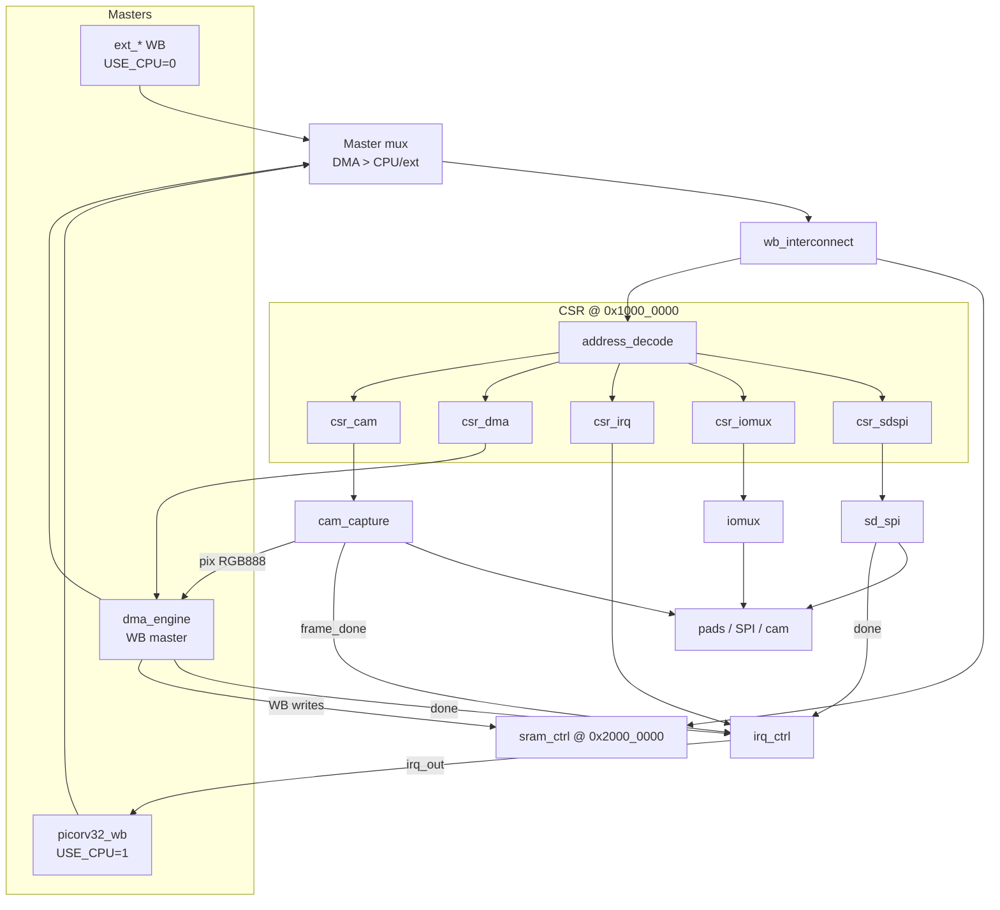

# Dashcam SoC — Top-Level Integration

Concise architecture note for the integrated `dashcam_soc_top` after wiring the
verified IP blocks through the Wishbone fabric. Register field detail lives in
[`register_map.md`](register_map.md); IP interfaces live under [`ip/`](ip/).
Conventions follow [OpenTitan](https://github.com/lowRISC/opentitan)-style
hierarchical CSR bases on a shared bus map.

## Hierarchy

```text
dashcam_soc_top
├── rst_sync                         async assert / sync deassert
├── picorv32_wb                      USE_CPU=1 Wishbone master (else external)
├── wb_interconnect                  window decode: CSR | SRAM
│   ├── s0 → soc_csr → address_decode
│   │         ├── csr_cam    @ 0x1000_0000
│   │         ├── csr_dma    @ 0x1000_0100
│   │         ├── csr_irq    @ 0x1000_0200
│   │         ├── csr_iomux  @ 0x1000_0300
│   │         └── csr_sdspi  @ 0x1000_0400
│   └── s1 → sram_ctrl       @ 0x2000_0000
├── cam_capture                      pixel pack + FIFO → DMA
├── dma_engine                       Wishbone master → SRAM
├── irq_ctrl                         rising-edge pending + enable mask
├── iomux                            pad mux peripheral stub
└── sd_spi                           SPI peripheral stub
```

`wb_periph_stub` remains a reusable Wishbone CSR template for IP benches; the
SoC uses the functional `sd_spi` / `iomux` / `rst_sync` stubs instead.

## Architecture diagram




## Bus address map

| Region | Base | Size / aperture | Slave |
|--------|------|-----------------|-------|
| Camera CSR | `0x1000_0000` | 256 B (`adr[11:8]==0`) | `csr_cam` → `cam_capture` |
| DMA CSR | `0x1000_0100` | 256 B | `csr_dma` → `dma_engine` |
| IRQ CSR | `0x1000_0200` | 256 B | `csr_irq` → `irq_ctrl` |
| IOMUX CSR | `0x1000_0300` | 256 B | `csr_iomux` → `iomux` |
| SDSPI CSR | `0x1000_0400` | 256 B | `csr_sdspi` → `sd_spi` |
| SRAM | `0x2000_0000` | depth words × 4 B | `sram_ctrl` |

Apertures are disjoint: `address_decode` derives select nibbles from
`include/regs_defines.vh` and fails elaboration if any collide. Unmapped CSR
offsets return a one-cycle miss ACK with zero data.

## Interrupt vector assignments

Rising-edge events are latched into `IRQ_PENDING` (W1C). `IRQ_STATUS` is
`PENDING & ENABLE`. `irq_out` is the OR of masked pending bits.

| Bit | Name | Source IP signal | Typical clear path |
|-----|------|------------------|--------------------|
| 0 | `CAM` | `cam_capture.frame_done` | W1C `IRQ_PENDING[0]`; retire by clearing `CAM_CTRL.ENABLE` |
| 1 | `DMA` | `dma_engine.done` | W1C `IRQ_PENDING[1]`; retire by clearing `DMA_CTRL.ENABLE` |
| 2 | `SDSPI` | `sd_spi.done` | W1C `IRQ_PENDING[2]`; retire by clearing `SDSPI_CTRL` / deassert CS |

## `USE_CPU` behavior

| `USE_CPU` | Active master (when DMA idle) | `irq_out` consumer |
|-----------|-------------------------------|--------------------|
| `0` (default) | External Wishbone ports `ext_*` | Host / testbench |
| `1` | `picorv32_wb` | CPU `irq` pin |

DMA always preempts the selected host master while `dma_cyc` is asserted.

## Datapath smoke path

1. Host programs `CAM_FRAME_*`, `DMA_DST_ADDR` / `DMA_LENGTH`, then enables DMA and CAM.
2. Camera pads deliver RGB bytes; `cam_capture` pushes RGB888 into its FIFO.
3. `dma_engine` drains pixels as Wishbone writes into `sram_ctrl` at `0x2000_0000`.
4. Sticky `frame_done` / `done` rise → `irq_ctrl` pending bits; smoke reads SRAM and prints `SMOKE_PASS`.
